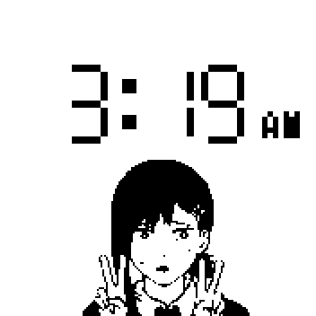
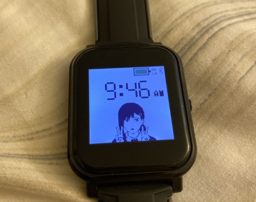

# Kobeni Clock

Screenshot                                 | Photo
:-----------------------------------------:|:-------------------------------------------:
 |  |

A clock face featuring Kobeni.

## Getting Started

Go to [Espruino IDE](https://www.espruino.com/ide/#) in a Web
Bluetooth-compatible browser (i.e. Chrome).

Ensure Bangle.js watch is Bluetooth-connectable (`Settings->Bluetooth->Make
Connectable->Yes`) and connect to Bangle.js in Espruino IDE.

In Espruino IDE, click Storage icon and upload `kobeniclock.app.js` to watch.
Copy-paste contents of `scripts/create-icon-and-info.js` into Espruino IDE
console and run code.